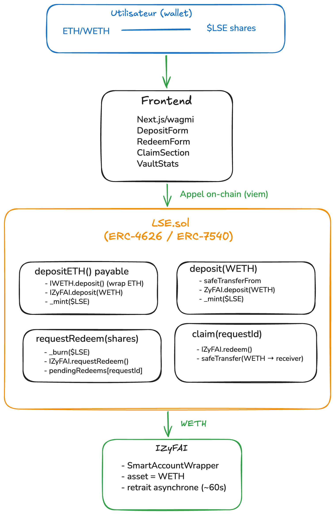

# Projet $LSE — Liquid Stock ETH

> Un moyen simple et transparent de faire travailler votre ETH, en utilisant une des meilleures infrastructures d'agent IA du marché, sans la complexité d'une gouvernance active.

Formation Blockchain Alyra 2026

---

## Concept

$LSE est un **vault DeFi sur Base** (L2 OP Stack). L'utilisateur dépose de l'ETH ou du WETH, reçoit des tokens `$LSE` représentant sa part du vault, et un agent IA (ZyFAI) fait travailler cet ETH automatiquement pour générer du rendement. Pas de DAO, pas de vote, pas de complexité.

---

## Architecture — Vault de Vault

`LSE.sol` dépose le WETH directement chez ZyFAI — aucune conversion intermédiaire. L'utilisateur peut déposer de l'ETH natif : le wrap est effectué en interne et reste invisible.



---

## Flux opérationnels

### Dépôt (synchrone)

```
Option A — WETH : deposit(amount)
  1. LSE pull le WETH de l'utilisateur
  2. ZyFAI.deposit(WETH)
  3. mint $LSE à l'utilisateur

Option B — ETH natif : depositETH()
  1. LSE wrappe l'ETH reçu en WETH
  2. ZyFAI.deposit(WETH)
  3. mint $LSE à l'utilisateur
```

### Retrait (asynchrone — ERC-7540)

```
Étape 1 — requestRedeem(shares)
  → $LSE brûlés immédiatement
  → ZyFAI.requestRedeem()
  → requestId retourné (~60s de traitement)

Étape 2 — claim(requestId)
  → ZyFAI.redeem() → WETH transféré directement au receiver
```

---

## Mécanique du prix

```
Prix $LSE = totalAssets (WETH chez ZyFAI) ÷ totalSupply ($LSE)
```

Le yield généré par ZyFAI augmente `totalAssets` sans changer `totalSupply`. Le prix du $LSE monte donc passivement, sans aucune action de l'utilisateur.

```
t=0 : NAV = 10 ETH, 10 LSE → 1 LSE = 1.0 ETH
t=1 : ZyFAI génère 1 ETH de yield
      NAV = 11 ETH, 10 LSE → 1 LSE = 1.1 ETH
```

---

## Acteurs

| Acteur | Rôle |
|---|---|
| **Équipe $LSE** | Déploie et maintient `LSE.sol`. Ne gère aucun fonds, aucune clé privée. |
| **ZyFAI** | Exécute les stratégies de yield. Prend 10% de commission sur les performances. |
| **Utilisateur** | Dépose ETH ou WETH, reçoit `$LSE`. Responsable de ses décisions d'investissement. |
| **Curateurs externes** | DeFiLlama, Stakehouse, Pharos Watch — analyse et notation indépendantes. |

---

## Comparatif marché

| Concurrent | Leur approche | L'approche $LSE |
|---|---|---|
| **Lido** | Une stratégie : staking ETH. Simple, limité. | Une infra (ZyFAI) accédant à multiples stratégies. |
| **Yearn / Beefy** | Dizaines de vaults, stratégies opaques, gestion manuelle. | Un vault, un agent IA. Transparent et déterministe. |
| **ETF ETH (BlackRock)** | Tiers garde l'ETH, aucun rendement. | L'utilisateur garde ses `$LSE`, tous les rendements lui reviennent. |

---

## Stack technique

| Composant | Technologie |
|---|---|
| Réseau | Base (L2 OP Stack) |
| Smart Contract | Solidity ^0.8.28, ERC-4626 + ERC-7540 |
| Framework | Hardhat v3 |
| Déploiement | Hardhat Ignition |
| Tests | Mocha + Ethers v6 — 21 tests |
| Yield | ZyFAI SmartAccountWrapper (WETH, Base Mainnet) |
| Frontend | Next.js + Tailwind CSS |

---

## Structure du repo

```
lse/
├── backend/
│   ├── contracts/
│   │   ├── LSE.sol                   # Vault principal ERC-4626 / ERC-7540
│   │   ├── interfaces/
│   │   │   └── IZyFAI.sol            # Interface ZyFAI SmartAccountWrapper
│   │   └── mocks/
│   │       ├── MockERC20.sol         # ERC20 avec mint (tests)
│   │       └── MockZyFAI.sol         # Vault ZyFAI simulé (tests)
│   ├── test/
│   │   └── LSE.test.ts               # 21 tests Mocha
│   ├── ignition/modules/
│   │   ├── LSE.ts                    # Module de déploiement production
│   │   └── LSEDemo.ts                # Module de déploiement démo / testnet
│   └── hardhat.config.ts
├── frontend/                         # Interface utilisateur Next.js
└── docs/
    └── MyNotes.md                    # Notes de développement
```

---

## Lancer le frontend

```bash
cd frontend
npm install
npm run dev
```

Ouvre [http://localhost:3000](http://localhost:3000) dans le navigateur.

---

## Lancer les tests

```bash
cd backend
npm install
npx hardhat test
```

---

## Déploiement

```bash
# Réseau local
npx hardhat ignition deploy ignition/modules/LSEDemo.ts --network hardhatOp

# Sepolia (testnet — mocks inclus)
npx hardhat ignition deploy ignition/modules/LSEDemo.ts --network sepolia

# Base Mainnet (production — nécessite l'adresse ZyFAI WETH dans params/base.json)
npx hardhat ignition deploy ignition/modules/LSE.ts --network base --parameters ignition/params/base.json
```

---

## Variables d'environnement

```
SEPOLIA_RPC_URL=...
SEPOLIA_PRIVATE_KEY=...
```

---

## Vision long terme

- Intégration d'un second agent (**Giza**) en compétition avec ZyFAI
- Détenir des $LSE pour avoir le droit de faire des prédictions sur la performance des agents
- Protocole open source : toute entité peut déployer un vault compatible

---

## Références

**Standards**
- [EIP-4626 — Tokenized Vault Standard](https://eips.ethereum.org/EIPS/eip-4626)
- [EIP-7540 — Asynchronous ERC-4626 Tokenized Vaults](https://eips.ethereum.org/EIPS/eip-7540)
- [erc7540-wrapper — implémentation de référence (ondefy)](https://github.com/ondefy/erc7540-wrapper)

**Infrastructure**
- [Base — L2 OP Stack](https://base.org)
- [ZyFAI — Agent IA de yield](https://zyfi.org)

**Curateurs indépendants**
- [DeFiLlama](https://defillama.com)
- [Pharos Watch](https://pharos.watch)

## Outils

- VSCode : IDE pour écrire le code en général
- Remix : Pour tester/appeler les contrats déjà déployés
- Claude Code :
  - Assistance dans la construction du frontend
  - Assistance pour l'amélioration de la documentation : README, commentaires de code
  - Diagramme ASCII du flux de dépôt et retrait